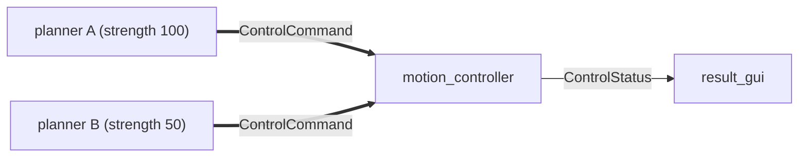

# Stage 1 - Conception guide

Guide for writing `scenarios/<name>/concept.md` (blank copy created by `./protorig new scenario <name>`).
Next stage: the scenario `README.md` (the spec). Gate: G0, see Section 7.

## How to use this template

- Purpose of Stage 1: decide WHAT the demo proves, to WHOM, and HOW the audience will see it. Not how it is built.
- Fill Sections 1-7 in order. Section 7 (Review) is filled last and decides whether the concept moves to Stage 2.
- Iterate freely: diverge (alternative scenarios), red-team (skeptic personas), storyboard, re-review. Stage 1 is the cheapest place to change the story.
- Use stable IDs so later stages can trace back: challenges `C1..Cn`, beats `B1..Bn`, proof points `P1..Pn`, risks `R1..Rn`.
- Out of scope for Stage 1 (belongs in the scenario README and later stages): formal requirements, acceptance thresholds, test cases, IDL fields, QoS values, domains/partitions, transports.
- Keep each section short. If a section needs more than a screen, the concept is not yet focused.

## Stage 1 document structure

| # | Section | Answers the question |
|---|---|---|
| 1 | Core customer challenge solved | What problem does the customer have today? |
| 2 | How this scenario shows Connext solves it | Which Connext capability solves each challenge, and where is it shown? |
| 3 | Storyline and audience | What story do we tell, and to whom? |
| 4 | Demo beats | What happens, moment by moment, and what DDS impact does each moment prove? |
| 5 | Concept topology and dataflow | What talks to what, logically? |
| 6 | Proof points, feasibility risks, constraints | What claims do we make, what might not work, what limits us? |
| 7 | Review | Is the concept traceable, impactful, and ready for Stage 2? |

---

## Section 1 - Core customer challenge solved

**Purpose:** anchor the demo in a real customer pain, not a DDS feature.

**Must contain:**
- One headline sentence: the core challenge, in the customer's language (safety, uptime, cost, certification, integration effort).
- 2-5 specific challenges `C1..Cn`, each describing:
  - how it is typically solved today (the status quo)
  - why that is painful (cost, risk, time, certification, scalability)

**Rules:**
- Write from the customer's point of view. No Connext or DDS terms in this section.
- Each challenge must be something the target audience would recognise from their own project.

**Format:**
```
Headline: <one sentence>
- C1 <short name>: <status quo> -> <pain>
- C2 ...
```

---

## Section 2 - How this scenario shows Connext solves it

**Purpose:** map each customer challenge to a Connext capability and to the beat that makes it visible.

**Must contain:**
- A traceability table: Challenge -> Connext capability -> Beat(s) -> Proof.
- A one-line pitch that summarises the value.

**Rules:**
- Every challenge `Cn` must map to at least one beat.
- Capabilities should be concrete mechanisms (e.g. Ownership QoS, Deadline QoS, discovery, Routing Service), not slogans.
- The proof must be observable in the demo, not narrated.

**Format:**
```
| Challenge | Connext capability | Shown in beat | Proof |
One-line pitch: <sentence>
```

---

## Section 3 - Storyline and audience

**Purpose:** define the narrative and who it is for.

**Must contain:**
- Industry and sub-category (e.g. Automotive / Robo-taxi).
- Primary audience (e.g. architects, safety engineers, management) and what they care about.
- Storyline: 3-6 sentences describing the scenario as the audience experiences it.
- The "wow moment": the single moment the audience should remember.
- 30-second test: what a passer-by who watched for 30 seconds should remember.
- Target duration.

---

## Section 4 - Demo beats

**Purpose:** the storyboard. Each beat is one observable moment that proves one thing.

**Must contain:** a table with these columns (standard beat format):

| Column | Content |
|---|---|
| # | Beat ID `B1..Bn` |
| Beat | Short name |
| Audience sees | What is visible on screen or hardware |
| DDS mechanism | The Connext capability that makes it happen |
| Customer impact | The outcome in customer terms; should link to a `Cn` |
| Proof on screen | The observable evidence (metric, colour change, count) |

Optionally add a separate "Talk track" list with one line per beat for the presenter.

**Rules:**
- A beat that cannot name both a DDS mechanism and a customer impact is decoration: cut or merge it.
- Prefer measured proof (ms, metres, counts) over claims.
- Mark optional beats (e.g. `B6b`).

---

## Section 5 - Concept topology and dataflow

**Purpose:** a logical picture of the system, to check the story is buildable and looks distributed. Which machine runs what goes in `scenario.yaml` later.

**Must contain:**
- App list: name, kind (`vehicle`, `tooling` or `sim`, as in `apps/`), role. Languages follow the repo's ground rules. Reuse shared apps (`node_agent`, `result_gui`, `control_panel`) where they fit.
- Topic names follow `docs/WORKFLOW.md#naming-conventions` (they appear on screen in front of customers).
- Topology diagram (Mermaid preferred; renders in VS Code/GitHub and is easy for AI to parse).
- Dataflow table: topic name (working name), from -> to, why it matters in the story.
- Physical mapping intent: which nodes run on separate hardware, and why (e.g. to make a cable pull real).

**Rules:**
- Logical level only. No IDL fields, QoS values, domain IDs or transports (those are Stage 3).
- Highlight the "hero flow": the dataflow that carries the main value.

---

## Section 6 - Proof points, feasibility risks, constraints

**Purpose:** capture what the demo claims and what might break the story, without writing requirements.

**Must contain:**
- Proof points `P1..Pn`: the claims the demo makes, with order-of-magnitude targets (e.g. "blind distance about 1 m"). These become the README's acceptance tests in Stage 2.
- Feasibility risks `R1..Rn`: assumptions the story depends on that are not yet proven, where a wrong assumption would break a beat. Kinds: middleware behaviour (does Connext do X, how fast), visual/physical (can the audience see or trigger it), practical (hardware, venue network). Each risk has a spike and a fallback.
- Constraints: fixed limits that shape the story (hardware to carry, demo length, venue, network, audience language, Connext version, language policy).
- Explicit simplifications: where the demo differs from reality (so they can be stated honestly to the audience).

**Rules:**
- Keep it minimal: 1-3 risks, 3-5 constraints. List only what would break a beat or shape the story.
- If every mechanism was proven in an earlier demo, write `Risks: None - all mechanisms proven in <demo>`.

**Spikes (light approval):**
- A spike is a small throwaway experiment (typically under 1 hour, about 100 lines, no GUI) that answers one yes/no question for one risk. It is not the start of the demo code.
- Before running a spike, Claude states it in the format below and waits for a one-word "go" from the reviewer. No full spec or review is needed.
- After the spike, record the result and update the concept if the answer is No.

**Spike format:**
```
- R<n> <assumption>
  - Question: <one yes/no question>
  - Method: <smallest experiment that answers it>
  - Fallback if No: <how the concept changes>
  - Status: PROPOSED | APPROVED | PASSED (<measured result>) | FAILED (<measured result>) | ACCEPTED (not spiked, risk accepted)
```

---

## Section 7 - Review

**Purpose:** decide whether the concept is ready for Stage 2. Fill last; re-run after every iteration.

**Must contain:**

1. **Traceability check**
   - Every `Cn` maps to at least one beat.
   - Every beat maps to at least one `Cn` (or is marked setup-only and justified).
   - Every beat has a proof point.
2. **Scorecard**: rate each criterion High / Medium / Low with a one-line reason.

   | Criterion | Question |
   |---|---|
   | Real pain | Does the target audience have this problem today? |
   | Visible moment | Does something visibly change within 10 s of the trigger? |
   | Uniquely DDS | Is it hard to achieve with SOME/IP, MQTT, or custom code? |
   | Credible | Would an engineer accept it as not rigged? |
   | Reusable | Does it transfer to other industries/sub-categories? |
   | Simple | Is this the fewest apps, topics and beats that still prove the value? Name anything that could be cut. |

3. **Red-team objections**: the 2-3 strongest objections from a skeptic persona, and the answer (or gap).
4. **Gaps and actions**: numbered list of open decisions and spikes.
5. **Verdict**: one of `READY FOR STAGE 2` / `ITERATE` / `DROP`, with one sentence of reasoning.

**Exit rule (Gate G0):** proceed to the scenario README only when the verdict is `READY FOR STAGE 2`, no scorecard item is Low (Simple included: cut before proceeding), and all feasibility risks are `PASSED` or `ACCEPTED`.

---
---


# Example - Robo-taxi planner failover (minimal)

A deliberately small example: 4 nodes, 2 dataflows, 3 beats.

## Section 1 - Core customer challenge solved

Headline: A robo-taxi has no safety driver, so if the autonomy computer fails, a backup must take control immediately and predictably.

- C1 Bespoke failover logic: teams write their own heartbeat and switchover code -> costly to verify and certify, and easy to get wrong.
- C2 Slow detection: application heartbeats with retries -> hundreds of ms with no valid control, several metres at city speed.

## Section 2 - How this scenario shows Connext solves it

| Challenge | Connext capability | Shown in beat | Proof |
|---|---|---|---|
| C1 Bespoke failover logic | Exclusive Ownership with strength: the reader accepts only the strongest live writer | B1, B2 | Switchover happens with zero failover code in the application |
| C2 Slow detection | Liveliness and Deadline QoS: loss is detected within configured bounds | B1, B3 | Measured gap in ms and "blind distance" in metres |

One-line pitch: Failover becomes a QoS setting, not code you write and certify.

## Section 3 - Storyline and audience

- Industry: Automotive / Robo-taxi
- Audience: ADS and E/E architects (primary), safety engineers (secondary).
- Storyline: Two planner computers compute the same commands in parallel. The motion controller obeys only the strongest live one. The presenter pulls the primary's cable; the standby takes over within milliseconds. The primary comes back and reclaims control. Finally both are killed and the controller performs a safe stop.
- Wow moment: the owner banner flips from A to B the instant the cable is pulled, with a blind distance of about 1 m.
- 30-second test: "A computer died and the car kept driving, without any failover code."
- Target duration: about 3 minutes.

## Section 4 - Demo beats

| # | Beat | Audience sees | DDS mechanism | Customer impact | Proof on screen |
|---|---|---|---|---|---|
| B1 | Pull A's cable | Banner flips from A (blue) to B (orange) | Exclusive Ownership + Liveliness | Failover with no app code, bounded detection (C1, C2) | Gap in ms, blind distance in m |
| B2 | Reconnect A | Banner flips back to A | Strength-based ownership reclaim | Automatic failback, no manual handover (C1) | Owner timeline: A -> B -> A |
| B3 | Kill both | "No owner", car decelerates to stop | Deadline QoS on the reader | System knows it lost control instead of coasting (C2) | Time from last command to SAFE_STOP |

Talk track:
- B1: "No failover code. It is one QoS setting."
- B2: "Failback is automatic. Nobody issues a handover command."
- B3: "The controller knows it has lost authority. It does not coast on the last command."

## Section 5 - Concept topology and dataflow

Apps:

| App | Kind | Role |
|---|---|---|
| planner (x2: `--strength 100`, `--strength 50`) | vehicle | Publishes commands; one app, two instances |
| motion_controller | vehicle | Obeys current owner; safe stop if none |
| result_gui (shared) | tooling | Owner banner, gap and blind distance, timeline |



Dataflow (hero flow: ControlCommand):

| Topic | From -> to | Why it matters |
|---|---|---|
| ControlCommand | planner A, planner B -> motion_controller | Exclusive ownership decides who drives; no election code |
| ControlStatus | motion_controller -> result_gui | Current owner, gap and mode, shown to the audience |

Physical mapping intent: planner A on its own board (e.g. the Pi) so the cable pull is real; everything else on the presenter laptop.

## Section 6 - Proof points, feasibility risks, constraints

Proof points:
- P1 Switchover gap is tens of ms; blind distance about 1 m at city speed (B1).
- P2 Failback to planner A is automatic with no dropped commands (B2).
- P3 Safe stop starts within a few hundred ms of losing all owners (B3).

Feasibility risks:
- R1 Cable pull is detected fast enough through Liveliness alone.
  - Question: When the owner's cable is pulled, does the reader switch to the backup writer within tens of ms?
  - Method: Two minimal publishers (strength 100 and 50) on two machines, one subscriber printing the source writer with timestamps; pull the cable and read the gap.
  - Fallback if No: tighten the liveliness lease, add Deadline-based detection, or switch B1 to a process kill.
  - Status: PROPOSED

Constraints:
- Runs on one laptop plus one small board; also works with `--sim` on one laptop (process kill instead of cable pull).
- Connext 7.7 LTS; vehicle nodes POSIX-only (QNX-portable).

Simplifications (state to the audience):
- Planners output simple path-following commands, not real planning.

## Section 7 - Review

Traceability:
- C1 and C2 each map to at least one beat: PASS.
- Every beat maps to a challenge and has a proof point: PASS.

Scorecard:

| Criterion | Rating | Reason |
|---|---|---|
| Real pain | High | Driverless operation makes control continuity a top safety concern |
| Visible moment | High | Banner flips instantly on cable pull |
| Uniquely DDS | Medium | Audience may say "our supervisor does that"; no baseline comparison yet |
| Credible | High | Physical cable pull on real hardware, measured numbers |
| Reusable | High | Same pattern fits mining haul trucks and drone flight computers |
| Simple | High | 3 apps (planner runs twice), 2 topics, 3 beats; each beat maps to a challenge, nothing to cut |

Red-team objections:
- "Our in-house supervisor already does this." Gap: add a baseline comparison beat, or show the code line count difference.
- "One cable pull could be staged." Answer: let the audience pull the cable themselves.

Gaps and actions:
1. Decide whether to add a baseline-comparison beat to raise "Uniquely DDS".
2. Run spike R1.

Verdict: ITERATE. Strong and simple, but "Uniquely DDS" is Medium and R1 is not yet spiked.
