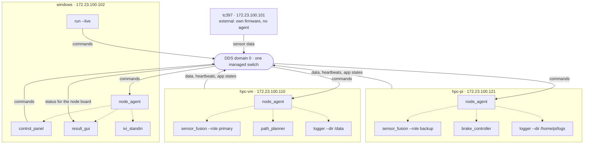

# Quick Start - Demo bring up guide

How to take a demo from "machines switched off" to "every app running".
Written for people new to this rig. The full design is in
[WORKFLOW.md](WORKFLOW.md).

Status (29 Sep 2026): some commands below are still being built.
Each step is marked:

    [available]  works today
    [planned]    designed and approved, not built yet

Until the planned parts exist, bring the rig up by hand: see
"Before agents exist" near the end.


## 1. The idea

A demo is a *scenario*: a folder under `scenarios/`. Its `scenario.yaml` is
the single plan of *what runs where*.

Each machine runs one small *agent*. The agent carries out only its own
machine's part of the plan.

You start the agents once. After that, one command (or the Control Panel)
tells every agent *when* to start, stop or kill its apps. A command never
says *what* to run or *how*: that always comes from `scenario.yaml`.


## 2. Words used in this guide

Scenario
: One demo: `scenarios/<name>/`. `scenario.yaml` says what runs where;
  `README.md` holds the story, demo beats and acceptance tests.

Node
: One machine in the scenario, e.g. `windows`, `hpc-vm`, `hpc-pi`.
  Each has an IP address in `scenario.yaml`.

Managed node
: A machine whose software comes from this repo (Windows, Linux VM,
  Raspberry Pi). It gets an agent.

External node
: A device whose software is built elsewhere, e.g. the TC397 ECU
  (`external: true`). Nothing from this repo runs on it and it has no
  agent. On your desk, a *sim twin* stands in for it.

`run:` list
: In `scenario.yaml`, the apps a managed node should run, with their
  arguments.

Agent (`node_agent`)
: One per managed machine. Starts, stops and kills that machine's apps
  when asked over DDS, and reports their state. Never starts anything
  that isn't in its own node's `run:` list.

Node board
: The part of `result_gui` that shows every machine and app:
  green = running, grey = stopped, red = lost or crashed.


## 3. Two ways to run a scenario

On your desk (`--sim`):

- No hardware: everything runs on one PC.
- External nodes are replaced by their sim twins.
- Nothing leaves your PC (DDS uses shared memory only).
- Command: `protorig run <scenario> --sim`
- Use it to build, test and rehearse.

On the real rig (`--live`):

- Every machine in the scenario, on one switch.
- External nodes are the real devices, powered on.
- Command: agents on each machine, then `protorig run <scenario> --live`
- Use it for the demo itself.

Rehearse with `--sim` first. The Control Panel, the node board and the demo
beats behave the same in both.


## 4. Bringing up the real rig, step by step

### Stage 0: once per machine, well before the demo

1. Clone the repo on every managed machine (Windows, VM, Pi).
   [available]

2. Set up Python and the Connext license on each machine.
   [planned] `bootstrap` will do this. Until then, by hand [available]:

       python3 -m venv .venv                  (Windows: py -3 -m venv .venv)
       .venv/bin/python -m pip install -r bootstrap/requirements.txt
       copy rti_license.dat into the repo's .local/ folder

3. Build the C/C++ apps on each machine that runs them:
   `protorig build`  [planned]

4. Check the scenario: `protorig check`  [available]
   It must show no errors for your scenario.

5. Check the IPs: every managed node's `ip:` in `scenario.yaml` must be
   that machine's real address on the rig's switch.

### Stage 1: power on the external devices

6. Switch on each external node (e.g. the TC397). It boots its own
   firmware and starts publishing. Nothing to start from the repo.

### Stage 2: start one agent per managed machine  [planned]

7. On each managed machine, once:

       protorig agent start <scenario> --node <this machine's node> --background

   Later this will happen automatically at boot.

8. Each agent then:
   - refuses if this machine doesn't have the node's IP (wrong machine),
     or if an agent for that node is already running;
   - writes this machine's discovery settings (the other nodes as peers,
     DDS bound to this machine's IP);
   - reads only its own node's `run:` list;
   - starts heartbeating and reports every listed app as `NOT_RUNNING`.

   No apps are running yet. The agents are waiting.

9. Check any node's agent, from any machine:

       protorig agent status <scenario> --node <node>

### Stage 3: bring the demo up, from one machine  [planned]

10. On any machine in the scenario (usually Windows):

        protorig run <scenario> --live

11. `run --live` waits until it hears every managed node's agent. It lists
    external nodes as "power it on".

12. It sends every agent "start `*`" (start everything on your list).

13. Each agent starts its own apps, on its own machine, with the arguments
    from `scenario.yaml`.

14. `run --live` prints each app as it comes up, and the node board turns
    green row by row. The demo is running.

### Stage 4: during the demo  [planned]

15. Use the Control Panel. Every button is a command to one agent (one
    machine) or to all of them (`*`):

        start <app> or *   start it, or everything on that machine's list
        stop  <app> or *   polite stop; forced after 10 s if it doesn't stop
        kill  <app> or *   immediate, as if it crashed; the agent stays up

    QoS variant switches and parameter changes go to the apps themselves,
    not to the agents.

### Stage 5: shutting down

16. Press Ctrl-C in the `run --live` window. Every agent stops its apps
    cleanly. The agents stay up, ready for the next `run --live`.

17. To stop an agent as well, on its own machine:

        protorig agent stop <scenario> --node <node>


## 5. Rehearsing on your desk (--sim)

    protorig run <scenario> --sim

This does stages 2 and 3, plus the external devices, in one go on one PC:

- one agent per managed node, each named after its node;
- a sim twin for each external node;
- then "start `*`" to every agent.

Everything stays on your PC. Stage 4 works exactly as on the rig. Ctrl-C
stops everything, agents included.

Today [available], `--sim` starts the apps directly, without agents: the
Control Panel's per-app commands work; per-machine commands arrive with the
agents [planned].


## 6. Reading the node board

Machine green, apps grey
: Agent alive; apps not started, or stopped on purpose.
  Do: `run --live`, or start them from the Control Panel.

App red, `CRASHED (exit N)`
: The app ended on its own with an error.
  Do: read the agent's console, or `build/<scenario>/<node>/agent.log`;
  then start it again.

App red, `KILLED`
: Killed by a command.
  Do: start it again when the beat is over.

Machine red, "lost"
: No heartbeat for 3 s: the agent crashed, the machine is off, or a cable
  is out.
  Do: check the machine and cable; start the agent again.

App `RUNNING` but no heartbeat
: The process is alive but not working (hung, or can't reach DDS).
  Do: stop and start it; read its log.


## 7. When something doesn't come up

`agent start` says "this machine doesn't have <ip>"
: You're on the wrong machine, or the IP in `scenario.yaml` is wrong.
  Run it on the right machine, or fix the IP.

`agent start` says "an agent for <node> is already running"
: It was started twice. `agent status` shows it; `agent stop` it first if
  you want a fresh one.

`run --live` keeps waiting for a node
: That machine's agent isn't running, or can't be reached.
  Run `agent status` for that node; check cable, IP and firewall.

An app shows `UNAVAILABLE`
: The app doesn't exist yet, or a C/C++ app isn't built on that machine.
  Create it, or run `protorig build` on that machine.

An agent's log says a command was refused
: The app isn't in that node's `run:` list, or the command was aimed at
  `node_agent` itself. Fix the command, or add the app to `scenario.yaml`
  and restart the agent.

No data from an external device
: It's off, not flashed, or not reachable.
  See `external/<device>/README.md` (e.g. the TC397's rig risks).


## 8. Before agents exist  [available]

Until agents and `--live` are built, bring the rig up by hand, one command
per machine:

    protorig run <scenario> --node <this machine's node>

It starts that machine's apps directly (same wrong-machine check and
discovery settings), shows their output with a `node/app` prefix, and
stops them all on Ctrl-C.


---

## EXAMPLE: adas-failover

A made-up demo with several apps per machine. `sensor_fusion` runs as the
primary on the VM and as the backup on the Pi.

```yaml
nodes:
  windows:
    ip: 172.23.100.102
    run: [result_gui, control_panel, ivi_standin]
  hpc-vm:
    ip: 172.23.100.110
    run: ["sensor_fusion --role primary", path_planner, "logger --dir /data"]
  hpc-pi:
    ip: 172.23.100.121
    run: ["sensor_fusion --role backup", brake_controller,
          "logger --dir /home/pi/logs"]
  tc397:
    ip: 172.23.100.101
    external: true
    sim: tc397_twin
```

### System topology



How to read it: every machine talks only through DDS; nothing starts
processes on another machine. Commands from `run --live` or the Control
Panel reach each machine's `node_agent`, which starts (dotted arrows) only
the apps in its own `run:` list. The apps and the TC397 publish on the same
domain, and `result_gui` shows the whole rig.

The diagram renders on GitHub, and in VS Code's Markdown preview
(Ctrl+K V) with the recommended Mermaid extension.

### What each agent reads: its own row, nothing else

    windows/node_agent   result_gui
                         control_panel
                         ivi_standin

    hpc-vm/node_agent    sensor_fusion --role primary
                         path_planner
                         logger --dir /data

    hpc-pi/node_agent    sensor_fusion --role backup
                         brake_controller
                         logger --dir /home/pi/logs

    tc397                no agent: runs its own firmware

The same app can appear on several machines with different arguments. Each
agent only knows its own version.

### Bring-up

1. Stage 0: the repo is cloned, and the C++ apps built on the VM and Pi.

2. Stage 1: power on the TC397. It starts publishing sensor data.

3. Stage 2: one agent per machine.

       Windows> protorig agent start adas-failover --node windows --background
       VM$      protorig agent start adas-failover --node hpc-vm  --background
       Pi$      protorig agent start adas-failover --node hpc-pi  --background

   The node board shows three machines and 9 app rows, all grey.

4. Stage 3: on Windows,

       protorig run adas-failover --live

   It hears `windows`, `hpc-vm` and `hpc-pi` (and lists `tc397: external,
   power it on`), then sends "start `*`" to each agent:
   - Windows starts `result_gui`, `control_panel`, `ivi_standin`;
   - the VM starts `sensor_fusion --role primary`, `path_planner`,
     `logger --dir /data`;
   - the Pi starts `sensor_fusion --role backup`, `brake_controller`,
     `logger --dir /home/pi/logs`.

   The node board turns green row by row. The TC397 feeds both
   `sensor_fusion`s, the primary drives `path_planner`, and
   `brake_controller` acts.

### Demo beats, all from the Control Panel

Failure: `hpc-vm` / kill `*`
: The VM's three apps turn red (`KILLED`). The Pi's backup `sensor_fusion`
  takes over. The VM's agent stays up.

Recovery: `hpc-vm` / start `*`
: The VM's apps come back, with their original arguments.

Clean stop: `*` / stop `logger`
: Both loggers turn grey (stopped on purpose). Everything else carries on.

A mistake, refused: `hpc-vm` / start `brake_controller`
: Nothing starts. The VM's agent logs "not in hpc-vm's run: list": only
  the Pi may run it.

Stop Windows' apps from the Control Panel: `windows` / stop `*`
: `result_gui` and `ivi_standin` stop. The Control Panel keeps running,
  because it sent the command.

### Always refused, whoever sends it

`hpc-pi` / start `logger --dir /tmp`
: Commands carry names only; arguments come from `scenario.yaml`.

`hpc-pi` / start `/bin/sh`
: Not an app name.

`hpc-vm` / stop `node_agent`
: An agent never acts on itself. Stop it on its own machine.

### Shutting down, and on your desk

Shutting down: Ctrl-C in the `run --live` window. All 9 apps stop cleanly;
the agents stay up.

On your desk: `protorig run adas-failover --sim` starts three agents named
`windows`, `hpc-vm` and `hpc-pi`, plus the TC397 twin, all on one PC. Every
beat above works the same way.
