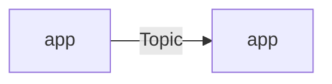

# {{name}} - concept

Stage 1. Guide and worked example: `docs/CONCEPT.md`. Fill sections 1-7; section 7 decides whether to write the README.

## 1. Core customer challenge solved

Headline:
- C1 <short name>: <status quo> -> <pain>

## 2. How this scenario shows Connext solves it

| Challenge | Connext capability | Shown in beat | Proof |
|---|---|---|---|
| C1 | | | |

One-line pitch:

## 3. Storyline and audience

- Industry:
- Audience:
- Storyline:
- Wow moment:
- 30-second test:
- Target duration:

## 4. Demo beats

| # | Beat | Audience sees | DDS mechanism | Customer impact | Proof on screen |
|---|---|---|---|---|---|
| B1 | | | | | |

Talk track:
- B1:

## 5. Concept topology and dataflow

| App | Kind | Role |
|---|---|---|
| | | |

| Topic | From -> to | Why it matters |
|---|---|---|
| | | |

Physical mapping intent:

## 6. Proof points, feasibility risks, constraints

Proof points:
- P1

Feasibility risks:
- R1 <assumption>
  - Question:
  - Method:
  - Fallback if No:
  - Status: PROPOSED

Constraints:
-

Simplifications (state to the audience):
-

## 7. Review

Traceability:
-

| Criterion | Rating | Reason |
|---|---|---|
| Real pain | | |
| Visible moment | | |
| Uniquely DDS | | |
| Credible | | |
| Reusable | | |
| Simple | | |

Red-team objections:
-

Gaps and actions:
1.

Verdict:
